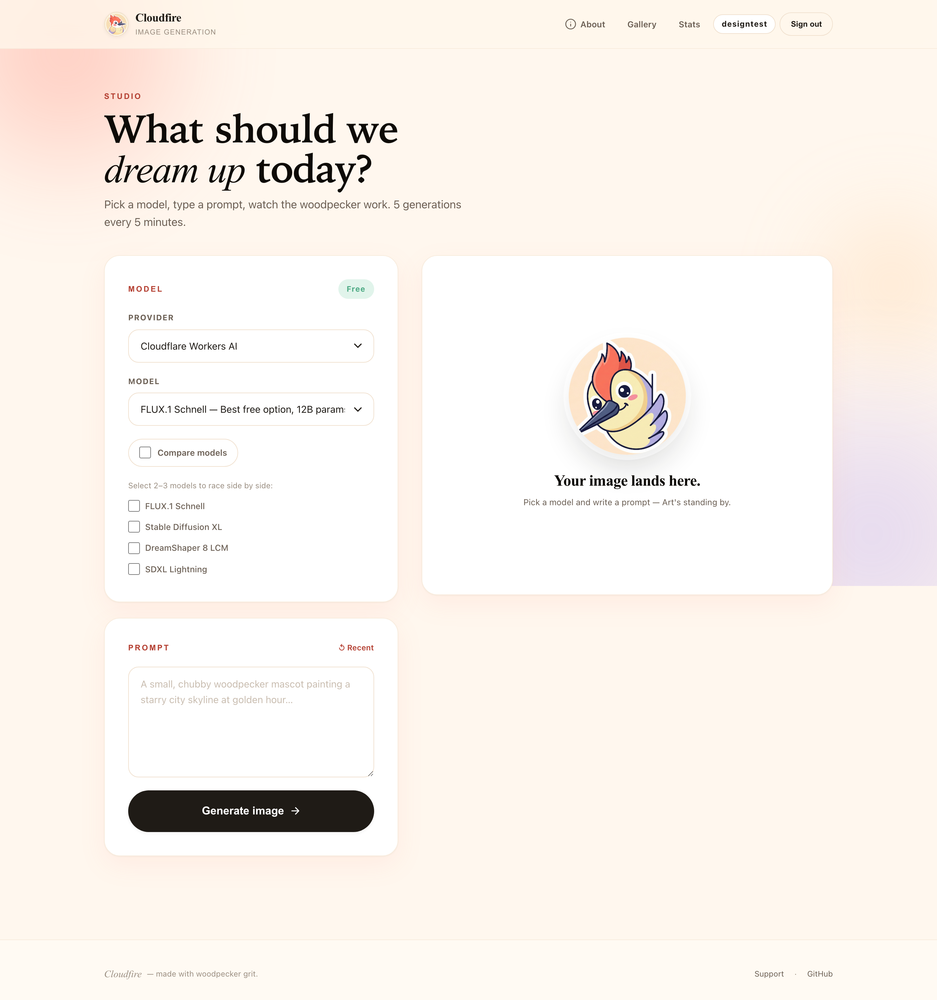
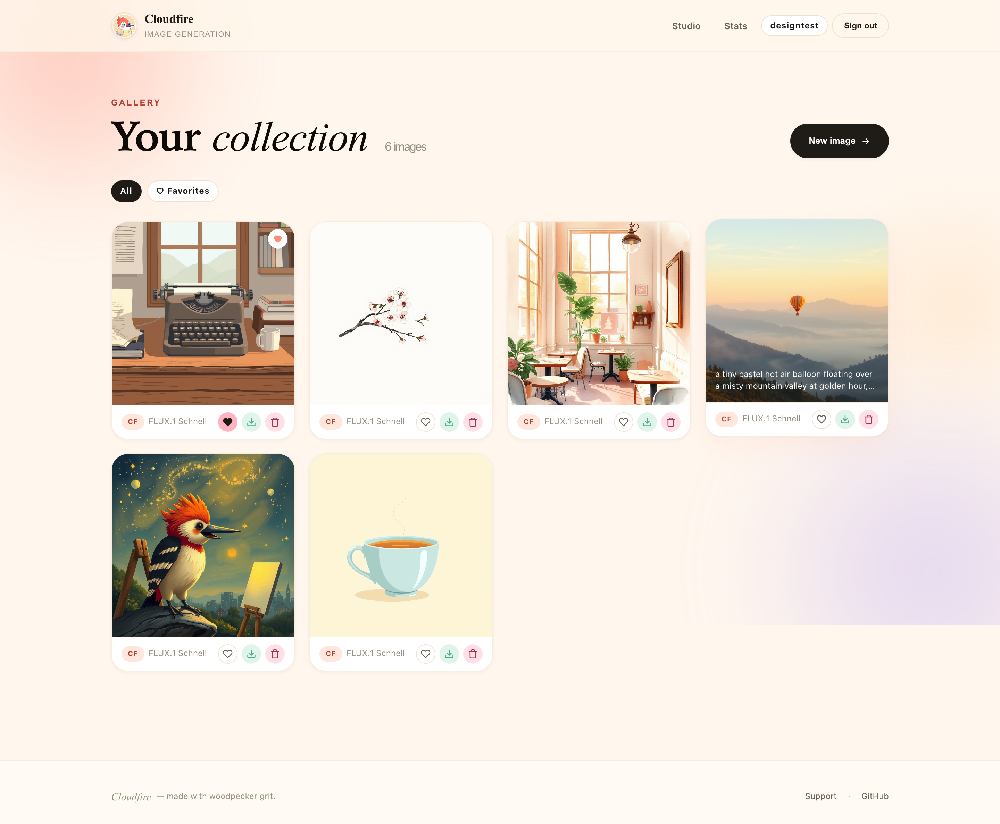
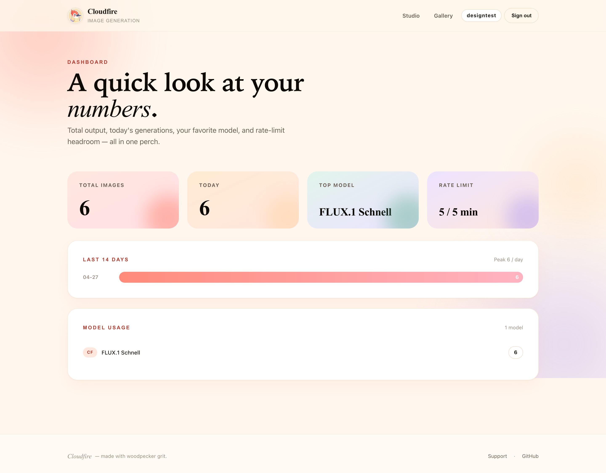
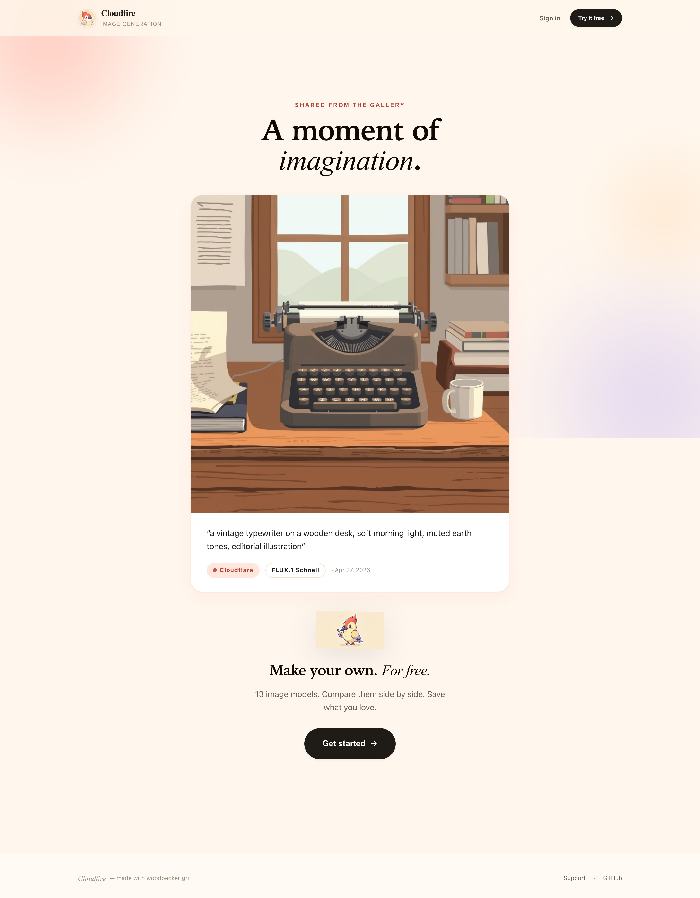
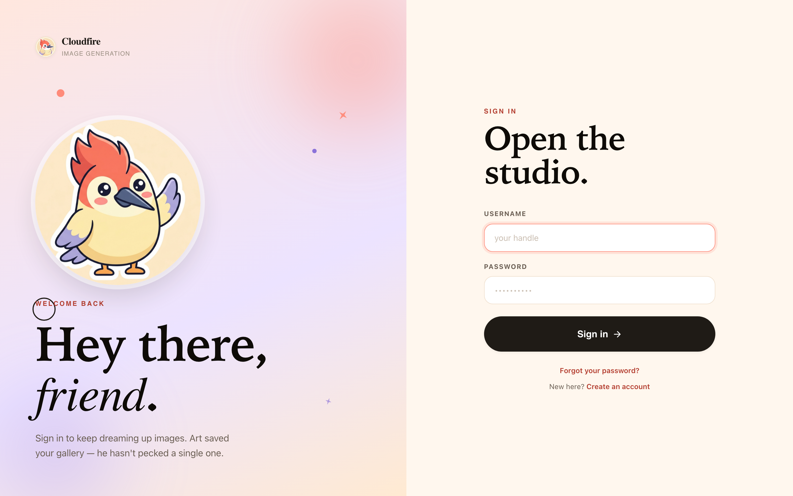
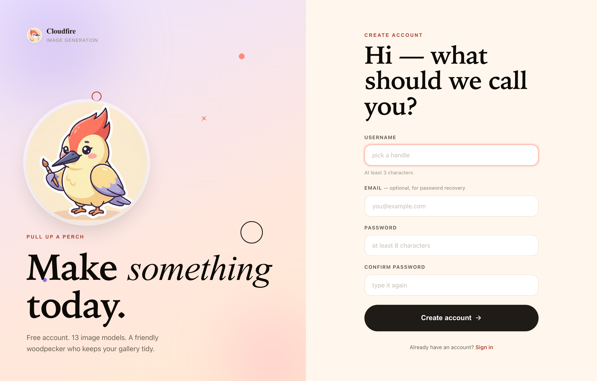

# Cloudfire Image Generation

A web app and CLI for generating images with **Cloudflare Workers AI** and **Google Gemini**. Built with FastAPI, hand-rolled pastel design system, and deployable to Railway in one click.

<p align="center"></p>

  

## Screenshots

| Studio | Gallery |
|---|---|
|  |  |

| Dashboard | Public share |
|---|---|
|  |  |

| Sign in | Create account |
|---|---|
|  |  |

## Features

- **Studio UI** with model selection, prompt history, image preview, and one-click download
- **13 models**: 11 Cloudflare (6 free, 5 paid) + 2 Gemini (admin-only)
- **Compare mode** — race the same prompt across 2–3 models side by side
- **Gallery** with favorites, tags, filters, and lightbox modal
- **Shareable public links** for individual images
- **Usage dashboard** with per-day and per-model breakdowns
- **Pastel agency design** — Fraunces display + Plus Jakarta Sans body, soft cream/coral/lavender palette, Art the woodpecker mascot
- **CLI scripts** for one-off generation (Cloudflare and Gemini)
- **Cloudinary-backed image storage** (CDN-hosted, persistent across deploys)
- **Self-service password reset** via email reset links
- **User authentication** (bcrypt-hashed passwords, signed session cookies)
- **Admin roles** (Gemini-restricted, rate-limit exempt)
- **CSRF protection** on all mutations
- **Rate limiting** (5 generations / 5 minutes / user)
- **Security headers** (CSP, HSTS, X-Frame-Options, etc.)
- **One-click Railway deployment**

## Quick Start

```bash
git clone https://github.com/nodelabstudio/gemini-n-cloudflare-imagegen-ai.git
cd gemini-n-cloudflare-imagegen-ai
pip install -r requirements.txt
```

Create a `.env` file in the project root:

```env
# Cloudflare (free)
CF_ACCOUNT_ID=your-account-id
CF_API_TOKEN=your-api-token

# Gemini (optional)
GEMINI_API_KEY=your-gemini-key

# Cloudinary (image storage)
CLOUDINARY_CLOUD_NAME=your-cloud-name
CLOUDINARY_API_KEY=your-api-key
CLOUDINARY_API_SECRET=your-api-secret
```

Run the web UI:

```bash
uvicorn app:app --reload
```

Open [http://localhost:8000](http://localhost:8000) in your browser.

## Deploy to Railway

1. Push this repo to GitHub
2. Go to [railway.com](https://railway.com) and create a new project from your repo
3. Click **+ New** > **Database** > **PostgreSQL** to add a database
4. Railway auto-injects `DATABASE_URL` into your app
5. Add your environment variables in the Railway dashboard under **Variables**:
   - `CF_ACCOUNT_ID`, `CF_API_TOKEN` (Cloudflare)
   - `GEMINI_API_KEY` (Google, optional)
   - `SESSION_SECRET` (generate with `python3 -c "import secrets; print(secrets.token_hex(32))"`)
   - `SMTP_HOST`, `SMTP_PORT`, `SMTP_USER`, `SMTP_PASS`, `FROM_EMAIL` (for password reset emails — see below)
   - `CLOUDINARY_CLOUD_NAME`, `CLOUDINARY_API_KEY`, `CLOUDINARY_API_SECRET` (image storage — see [cloudinary.com](https://cloudinary.com))

6. **Important:** Link the Postgres service to your web service so `DATABASE_URL` is auto-injected (or add it manually). Without this, the app falls back to SQLite which is wiped on every deploy.
7. Railway auto-detects the `Procfile` and deploys

### Email (Password Reset)

Password reset emails are sent via SMTP. We use [Resend](https://resend.com) (free tier: 100 emails/day).

1. Sign up at [resend.com](https://resend.com) and verify your sending domain
2. Add these variables in Railway:
   - `SMTP_HOST=smtp.resend.com`
   - `SMTP_PORT=587`
   - `SMTP_USER=resend`
   - `SMTP_PASS=re_your_api_key`
   - `FROM_EMAIL=noreply@yourdomain.com`

Without SMTP configured, the app still works — reset links are logged to the server console instead of emailed.

The database table is created automatically on first startup. Locally it uses SQLite (`images.db`) so you don't need PostgreSQL for development.

## Available Models

### Cloudflare Workers AI

| Key | Model | Tier |
|-----|-------|------|
| `flux-schnell` | FLUX.1 Schnell (default) | Free |
| `sdxl` | Stable Diffusion XL | Free |
| `dreamshaper` | DreamShaper 8 LCM | Free |
| `sd-lightning` | SDXL Lightning | Free |
| `sd-img2img` | SD v1.5 Img2Img | Free |
| `sd-inpaint` | SD v1.5 Inpainting | Free |
| `flux-2-dev` | FLUX.2 Dev (best quality) | Paid |
| `flux-2-klein-4b` | FLUX.2 Klein 4B | Paid |
| `flux-2-klein-9b` | FLUX.2 Klein 9B | Paid |
| `phoenix` | Leonardo Phoenix | Paid |
| `lucid` | Leonardo Lucid Origin | Paid |

### Google Gemini

| Key | Model |
|-----|-------|
| `gemini-2.5-flash` | Gemini 2.5 Flash |
| `gemini-3.1-flash` | Gemini 3.1 Flash (Preview) |

## CLI Usage

You can also generate images from the command line:

```bash
# Cloudflare
python3 cloudflare_image_gen.py "A lighthouse at sunset, digital art"
python3 cloudflare_image_gen.py --model=dreamshaper "your prompt"
python3 cloudflare_image_gen.py --models

# Gemini
python3 gemini_image_gen.py "your prompt"
python3 gemini_image_gen.py --diagnose
```

## API Keys Setup

### Cloudflare (free, ~2 min)

1. Sign up at [dash.cloudflare.com](https://dash.cloudflare.com) (no credit card)
2. Copy your **Account ID** from the dashboard sidebar
3. Create an API token at [dash.cloudflare.com/profile/api-tokens](https://dash.cloudflare.com/profile/api-tokens) using the "Workers AI" template

### Gemini

1. Get an API key at [aistudio.google.com/apikey](https://aistudio.google.com/apikey)
2. For image generation, you may need to [link a billing account](https://console.cloud.google.com/billing) (no minimum spend)

## Design System

The UI is a hand-rolled pastel agency aesthetic — no UI kit, no component library beyond Tailwind utilities.

- **Type:** [Fraunces](https://fonts.google.com/specimen/Fraunces) (variable serif, with `opsz` and `SOFT` axes) for display + [Plus Jakarta Sans](https://fonts.google.com/specimen/Plus+Jakarta+Sans) for body
- **Palette:** cream surfaces, coral primary, lavender accents, soft mint and peach for state colors. Tokens live in `static/css/app.css` as CSS variables
- **Mascot:** Art the woodpecker, generated via Gemini 3.1 Flash. Five poses (`art-{wave,paint,peek,sleep,logo}.png` in `static/img/`). Regenerate them with `python scripts/gen_mascots.py`
- **Components:** prefixed `cf-*` to avoid Tailwind clashes — `cf-btn`, `cf-card`, `cf-input`, `cf-mascot-frame`, `cf-tile`, `cf-stat`, etc.
- **Screenshots:** `python scripts/take_screenshots.py` (requires `pip install playwright && playwright install chromium`) writes to `docs/screenshots/`

## Security

- **Authentication:** Username/password with bcrypt-hashed passwords stored in PostgreSQL
- **Password Reset:** Self-service forgot password via email (SMTP through [Resend](https://resend.com))
- **Sessions:** Signed cookies (7-day expiry, SameSite=Lax, Secure flag in production)
- **CSRF:** Token-based protection on all POST/DELETE endpoints
- **Rate Limiting:** 5 image generations per 5 minutes per user (slowapi/limits)
- **Headers:** CSP, X-Frame-Options DENY, X-Content-Type-Options, HSTS (in production), Referrer-Policy, Permissions-Policy

### Cloudflare Reverse Proxy (recommended for production)

1. Add a custom domain to your Railway app (Settings > Networking > Custom Domain)
2. In Cloudflare DNS, add a CNAME record pointing to your Railway domain
3. Enable the orange cloud (Proxy) for DDoS protection, WAF, and SSL termination
4. Under Security > WAF, enable managed rulesets for additional protection

## Tech Stack

- **Backend:** FastAPI + Uvicorn
- **Frontend:** Tailwind CSS (CDN) + custom `app.css` design system
- **Type:** Fraunces (display) + Plus Jakarta Sans (body), via Google Fonts
- **Auth:** passlib + bcrypt, Starlette sessions
- **Email:** Resend (SMTP)
- **Database:** PostgreSQL (Railway) / SQLite (local dev)
- **Image Storage:** Cloudinary (CDN)
- **Providers:** Cloudflare Workers AI, Google Gemini
- **Deployment:** Railway
